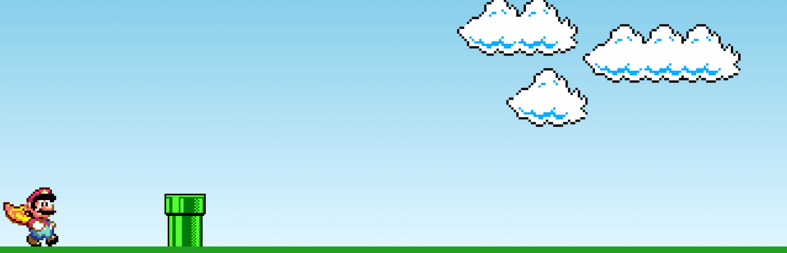
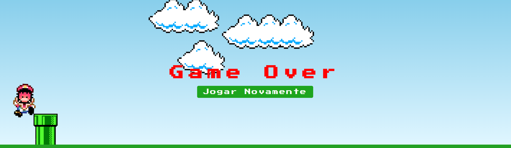

<h1 align="center"> Mario Jump! </h1>

Aplicação front-end desenvolvida com objetivo de praticar e reforçar conceitos de HTML, CSS e JavaScript. 

 

  

  

- [Acesse o projeto finalizado, online](https://bernardosa01.github.io/Mario-Jump/)
  

  

 

## 🚀 Tecnologias

Esse projeto foi desenvolvido com as seguintes tecnologias:

- HTML
- CSS
- JavaScript

 

## 💻 Projeto

- 
 Trata-se de um jogo simples, criado com HTML, CSS e JavaScript, onde o objetivo do Mario é pular o maior número possível de canos. Ao ser derrotado, é apresentada uma tela de "Game Over", junto com a opção do usuário reiniciar o jogo.   

---

Feito por Bernardo Sá :wave: [Participe da comunidade da Rocketseat!](https://discord.gg/rocketseat)